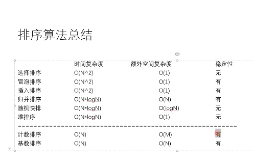

# 排序稳定性

## 定义

## 排序算法总结

1. 不基于比较的排序，堆样本数据有严格要求，不易改写
2. 基于比较的排序，只要规定好两个样本怎么比较大小就可以直接复用
3. 基于比较的排序，时间复杂度低于O(N)，且稳定的基于比较的排序是不存在
4. 为了绝对的速度选快排，为了节省空间选对排序，为了稳定选归并

## 常见的坑

1. 归并排序的额外空间复杂度变成O(1)，"归并排序内部换存法", 但是将变得不再稳定
2. "原地归并排序"是垃圾帖，会让时间复杂度变成O(N^2)
3. 快速排序稳定性改进，"O(1)stable sort"
